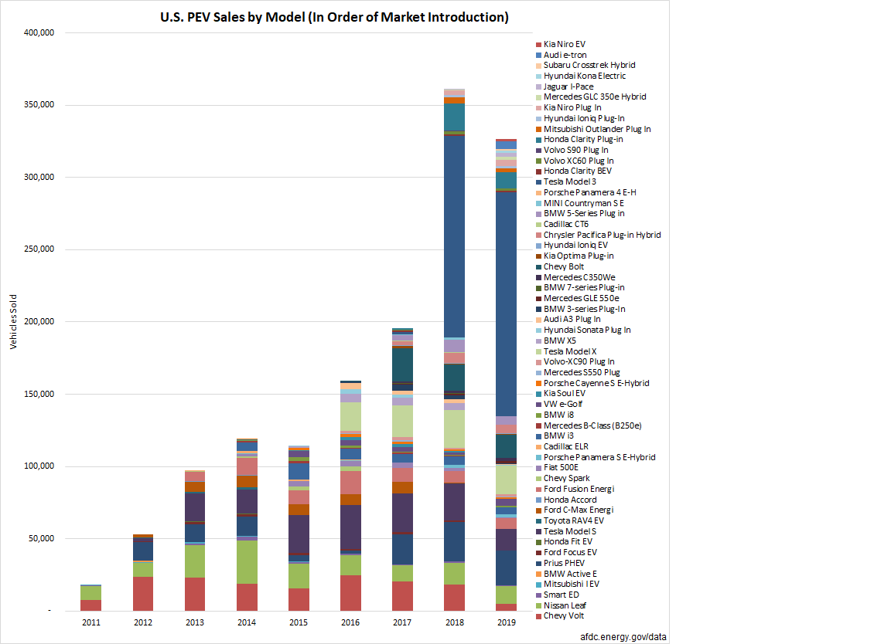
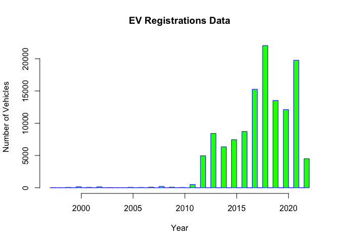

## What

My project is about analyzing the growth of electric vehicle sales
across The United States. I thought of figuring out by when all the
vehicles on the road will be battery powered. A number of states are
trying to pass laws banning the sale of new gas vehicles by 2035.
Considering the last gas vehicle sold in 2035 and average life of
vehicles, I expected the last gas powered car on road to run till 2050.
In real life a lot can happen that might deviate from this analysis.
With growing number of electric vehicles gas might not be available for
average consumer to run their vehicles. We might run into EV production
problems due to the trend in chip shortages we are facing now. The
technology might develop in a different direction causing EV sales to
decrease or ICE vehicle sales to increase.

## Why

Transportation is one of the main technological advancement that has
improved mankind’s survival. It allowed us access to almost all corners
of the world. The last few years have seen a drastic change in the
direction of the transportation technology. We saw hige growth in
electric vehicles with the success of Tesla. EVs are no longer seen as
inferior to ICE vehicles. This made me think about what my next vehicle
purchase would be. Would I still be able to run my gas powered vehicle
in future or would it be too expensive to maintain. So I wanted to do a
small analysis on the growth of EV vehicles and reduction of gas
vehicles over the years. It is too early to get good data to see
reduction of ICEs. Still I wanted to find if we will fully embrace EVs
by 2050.

## How

I got data for the EV registrations. It has thousands of data. However,
I had difficulty finding gas vehicle registrations data. Probably EV
manufacturers are actively publishing their data to show the growth
which in turn could increase their growth further. I found some excel
files and imported the data to RStudio. I will perform some plots and
histograms to see where the data is skewing towards and the rate of
growth to see how long it will take if we keep up the growth trend.

# Body

## Collecting Data and bringing it into R

I got the registration data from the website below:

<https://www.atlasevhub.com/materials/state-ev-registration-data/#data>

Here is a graph I got from the website that shows EV sales by Model.

    

I have imported the data as an excel file by using the readxl library
and then saved it to a variable called EVRegData.

## Data visualization

We can see the trend of the EV registrations over the years plotting a
simple histogram.

    D1 <- EVRegData$ModelYear
    hist(D1, breaks = 40, main = 'EV Registrations Data', xlab = 'Year', ylab = 'Number of Vehicles', col = 'Green', border = 'Blue')

    EVRegData %>% group_by(Model) %>% summarise(n=n())

    ## # A tibble: 104 × 2
    ##    Model                n
    ##    <chr>            <int>
    ##  1 2                  331
    ##  2 3-Series Plug in   179
    ##  3 5-Series Plug in   611
    ##  4 500e               522
    ##  5 7-Series Plug in    44
    ##  6 918 Spyder          13
    ##  7 A3 Plug In         528
    ##  8 A7 Plug In          11
    ##  9 A8 Plug In           3
    ## 10 Accord Plug In      13
    ## # … with 94 more rows

    EVRegData %>% group_by(`ModelYear`) %>% summarise(n=n())

    ## # A tibble: 24 × 2
    ##    ModelYear     n
    ##        <dbl> <int>
    ##  1      1997     6
    ##  2      1999    57
    ##  3      2000   153
    ##  4      2001    64
    ##  5      2002   147
    ##  6      2003    33
    ##  7      2005    66
    ##  8      2006    53
    ##  9      2007    90
    ## 10      2008   207
    ## # … with 14 more rows

## Analysis

We can see the growth in the EV registrations over the years.

# Topics from class

## R Markdown

We have used R Markdown extensively throughout the course. It is a great
tool to visualize the data and export as a document.

## Github

We learned to access github in the class. It is a great tool to publish
our documents or code. It is secure tool that is easy to use. The course
introduced the tool to us.

## Plot, boxplot, histogram

We learned to express the data visually through the tools like plot,
boxplot and histogram in the class. They are great tools to easily
visualize data.

## Probability

Probability is very important to analyze data in statistics. The class
has introduced probability. It allows us to guess the chance of
something happening. We use data analysis to visualize all
possibilities. Probability is very important for this.

## Tidy data

A clean data is very important to easily analyze it. Tidy data has great
tools to structure the data in a easy to understand manner.

# Conclusion

I do not have any previous experience with statistics and R. The class
has allowed me to get introduced to these topics. I have a lot to learn
yet. My project is very basic. I do not have the expertise to clean the
data properly and present it well. I should continue practicing.
